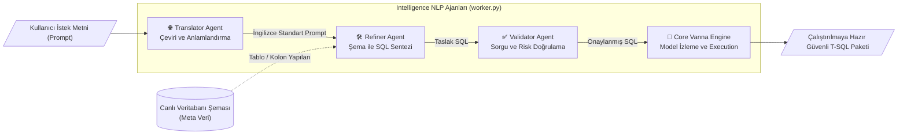
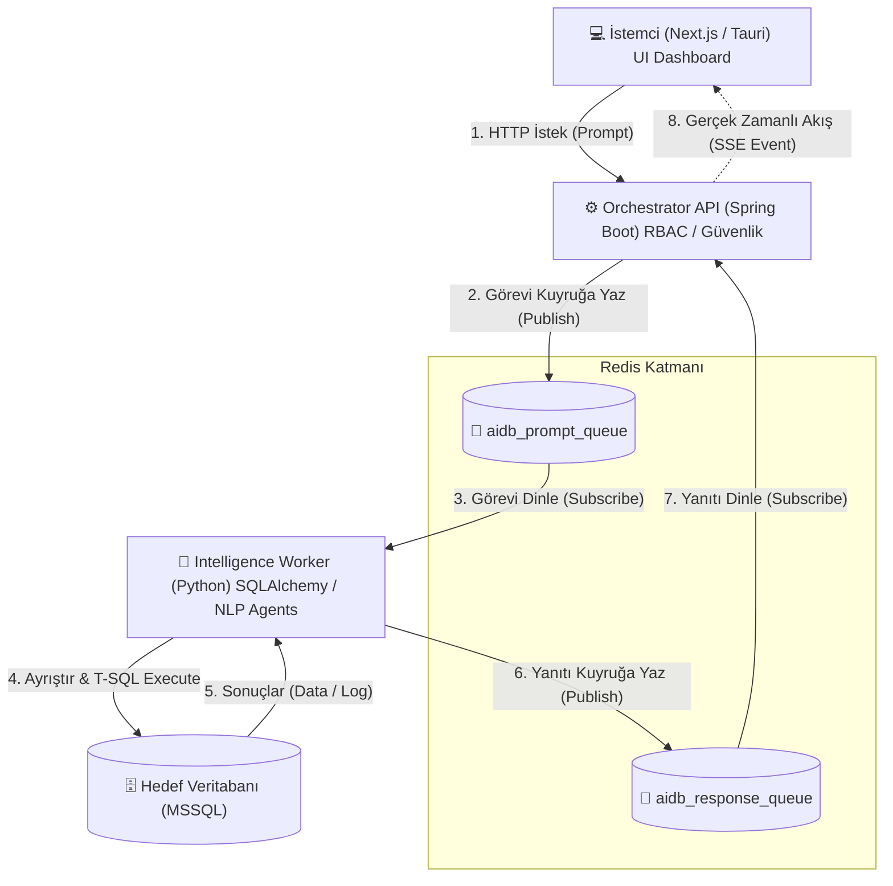
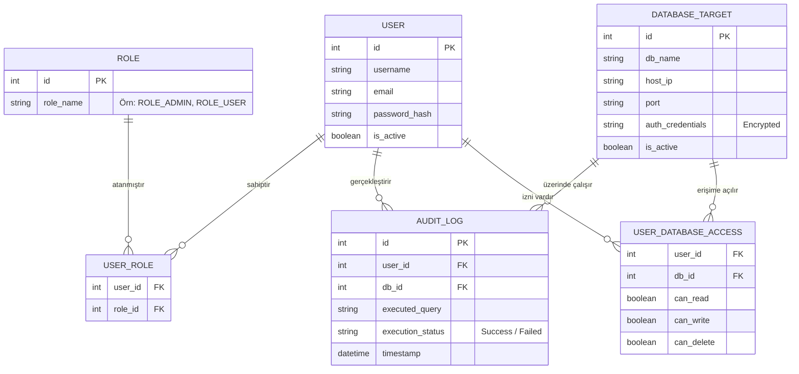
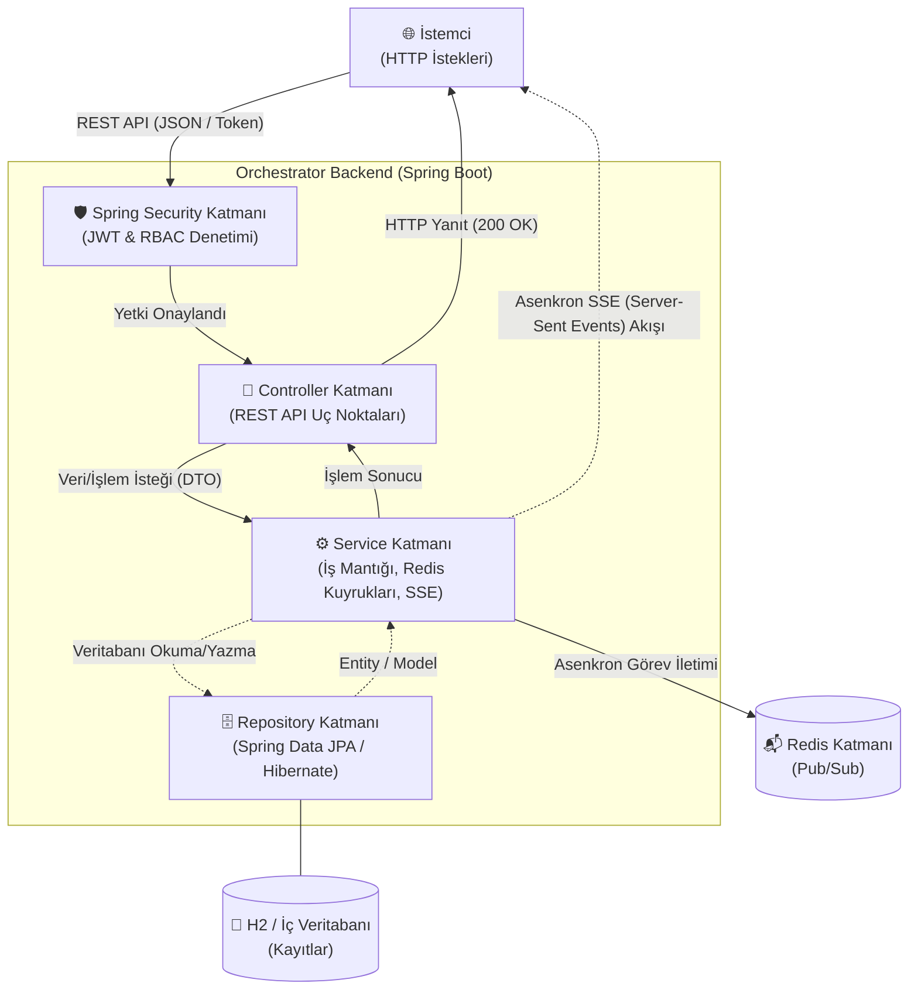
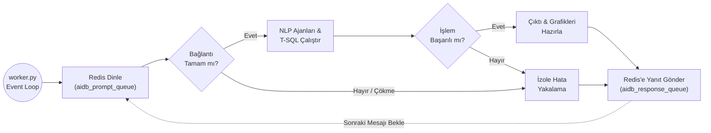
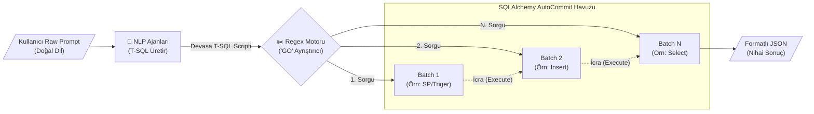

# 2. MATERYAL VE METOD

Bu bölümde, AIDB (Yapay Zeka Destekli Veritabanı Yönetim Sistemi) platformunun geliştirilmesinde referans alınan mimari kararlar, kullanılan teknoloji yığınları (tech stack), sistemlerin kendi içindeki iletişim kanalları ve dağıtık bileşenlerin asenkron entegrasyon metotları detaylıca incelenmektedir. Sistem temelde Frontend (İstemci), Orchestrator (Yönetici API) ve Intelligence (Yapay Zeka Destekli Veri İşleme) olmak üzere üç katmandan oluşmaktadır.

## 2.1. Kullanılan Materyaller

Sistemin temel amacı, veritabanı yöneticileri ve standart kullanıcılar için manuel sorgu yazım yükünü hafifletmek ve DDL/DML gibi kritik veritabanı işlemlerini web / masaüstü arayüzünden hatasız, güvenli bir şekilde yönetebilmektir. Bu doğrultuda, sektör standartlarında modern, esnek ve yüksek performanslı bileşenler bir araya getirilmiştir.

### 2.1.1. Sunucu Tarafı (Backend API / Orchestrator) Teknolojileri
Orchestrator isimli sunucu katmanında, geliştirme hızı ve hata toleransıyla endüstri standardı olan Java 8 dili kullanılarak Spring Boot (2.1.6.RELEASE) iskelet yapısı kurulmuştur. 
Sistem güvenliği, uç noktaların (endpoint) korunması ve modüler rol yönetimi işlemleri için Spring Security kullanılmıştır. Veri etkileşimi, saf SQL döngülerinden arındırılarak nesne tabanlı Spring Data JPA ve arka planda Hibernate O/RM (Object-Relational Mapping) araçlarıyla sağlanmıştır. Farklı servisler arası canlı veri transferini sağlamak adına bellek içi veri deposu ve mesaj kuyruğu olan Redis (`spring-boot-starter-data-redis`) entegre edilmiştir.

### 2.1.2. Veri İşleme (Worker / Intelligence Service) Teknolojileri
Yapay zeka tabanlı doğal dil işlemeyi, dinamik SQL üretimini ve üretilen bu T-SQL kodlarının hedef MSSQL veritabanlarında çalıştırılmasını yöneten "Intelligence Service" modülünde ana programlama dili olarak Python tercih edilmiştir.
Veritabanı bağlantıları ve güvenli sorgu çalıştırılması için SQLAlchemy ve pyodbc (ODBC Driver 17 for SQL Server) kütüphaneleri kullanılmıştır. Veri analitiği ve tablo işleme görevleri için Pandas kütüphanesinden yararlanılırken, grafik / rapor çıktıları otomatik olarak Plotly modülü destekli üretilmektedir. NLP (Doğal Dil İşleme) entegrasyonu için projenin kalbinde özel geliştirilmiş Ajan (Agent) blokları (TranslatorAgent, RefinerAgent, ValidatorAgent, vb.) yerleştirilmiştir. Servisler arası asenkron veri transferi için Redis Pub/Sub mekanizması kullanılmıştır.

> *Görsel 2.1: Python Worker Agent Pipeline (NLP Modülleri) Blok Diyagramı*



### 2.1.3. Kullanıcı Arayüzü (Frontend / Masaüstü) Teknolojileri
Ön yüz geliştirme katmanında uygulamanın doğrudan bir masaüstü uygulaması (Desktop App) olarak çalışması hedeflenmiş, ancak sistemin modern ve esnek olabilmesi için web teknolojileri kullanılarak tasarlanması kararlaştırılmıştır. Bu doğrultuda masaüstü form faktörünü sağlamak adına Tauri (`src-tauri`) altyapısı temel alınmış ve arayüzün inşasında Next.js (v16) ile React (v19) ekosistemleri kullanılmıştır.
Kullanıcı deneyimi tarafında iddialı, güçlü görsel hiyerarşi ve yüksek kontrast barındıran *"Elegant Drama"* konseptini kodlamak için TailwindCSS (v4) kütüphanesinden yararlanılmıştır. Arayüz elemanlarının modüler, erişilebilir (accessible) kalması için Radix UI ve form kontrollerinin hatasızlaştırılması için Zod ile entegre edilmiş React Hook Form kullanılmıştır. Dashboard ve veri analitikleri ekranlarının görselleştirilmesi adına Recharts ve Plotly.js sistem portföyüne dahil edilmiştir.

### 2.1.4. Veri Tabanı Yönetim Sistemi
Sistem iki farklı veritabanı profiline hizmet etmektedir: 
1. Uygulamanın kendi kayıtlarının yönetimi (Kullanıcı profilleri, loglar, yönetilen sunucu IP'leri vb.) için entegre çözümler ve bağımsız yapılar kurulmuştur (H2 vb.).
2. Uygulamanın komut yürüttüğü hedef kaynak sistemler olarak Microsoft SQL Server (MSSQL JDBC 7.2.2) üzerine çalışılmaktadır. Dynamic Connection String'ler ile anlık bağlantı yönetimi hedeflenmiştir.

### 2.1.5. Yardımcı Geliştirme Araçları
Uygulamanın çok farklı disiplinleri (Python, Java ve Javascript) aynı yapı altında birleştiren bağımlılık ağacının versiyon kontrolünü sağlamak için Git, paket yöneticisi olarak Java için Maven (pom.xml), Javascript için NPM (package.json) kullanılmıştır.

---

## 2.2. Uygulanan Metot

### 2.2.1. Genel Sistem Mimarisi
AIDB sistemi modern dağıtık yazılım (Distributed Architecture) örüntülerinden "Olay Güdümlü Mikroservis" (Event-Driven Microservices) yaklaşımı ile inşa edilmiştir. 
Akış metodu şu şekildedir: React tabanlı Frontend tarafından oluşturulan komut veya NLP isteği (Doğal Dil Promptu), Spring Boot Orchestrator katmanına REST API aracılığı ile ulaşır. Java Backend, yetki (RBAC) kontrolünü geçirip onayladığı eylemi doğrudan veritabanına iletmek yerine "Redis Mesaj Kuyruğuna" (Queue Message) bırakır (`aidb_prompt_queue`). Sunucudaki diğer bağımsız parça olan Python Intelligence Service (Worker) sürekli olarak Redis kuyruğunu dinlemektedir (Pub/Sub Listener). İsteği alır, NLP Agent'larıyla yorumlar, güvenli T-SQL sentezine parçalar, SQLAlchemy ile hedef sunucuya `AUTOCOMMIT` izole pool kurarak işlemi gerçekleştirir. Çıkan sonucu, grafik verisini veya arıza mesajını analiz edip tekrar `aidb_response_queue` üzerinden Redis ile Java sunucusuna geri postalar. Java sunucusu, SSE (Server-Sent Events) protokolü ile arayüzdeki kullanıcının ekranına bu anlık gelişmeyi yansıtır. Servisler birbirini beklemez, bloklamaz.

> *Görsel 2.2: AIDB Modülleri Asenkron Veri Akışı ve Genel Sistem Mimarisi*



### 2.2.2. Veritabanı Tasarımı
2.2.2.1. Kullanıcı ve Yetkilendirme (Role-Based Access) Tabloları
Projede katı bir görev ayrılığı yaratılması esastır. `Yönetici (Admin)` veya `Standart Kullanıcı` rolleri bağımsız tablolarına bölünmüş, kullanıcıya DDL (Create, Drop) veya DML (Update, Delete) yetkisi atayacak bağlantı tabloları Many-to-Many ilişkisi ile normalize kurallara uygun tasarlanmıştır.

> *Görsel 2.3: Kullanıcı, RBAC Rol atamaları ve Veritabanı Varlık-İlişki (ER) Diyagramı*



2.2.2.2. Veritabanı Kayıt ve Dinamik Bağlantı Tabloları
Uzak sistemlerin yönetimini esnetmek adına, veritabanı konfigürasyonları (IP, Port, Username, Integrated Security parametreleri vb.) kayıt tablolarında tutulur. Intelligence servisi, istek anında `JDBC Url` üzerinden parse ettiği stringleri Python için `mssql+pyodbc://` driver mantığına anlık çeviren (Dynamic Connection Pool) bir metoda oturtulmuştur.

2.2.2.3. İşlem Kayıtları (Log) ve Sistem Şeffaflık Tabloları
AIDB üzerinden atılan her kritik sorgu ve bu sorguyu atan kullanıcıların token/ip kalıntıları oluşturulan Denetim İzi (Audit Trail) yapısı ile veritabanında saklanır. Yapay zekanın "yanılsama (hallucination)" risklerine karşın tüm generated-SQL geçmişi arşivlenir.

### 2.2.3. Backend API Mimarisi
2.2.3.1. Genel Orchestrator Yapısı
Spring Boot ekosistemi kullanılarak, bağımlılıkların Inversion of Control (IoC) ve Dependency Injection (DI) prensibiyle (Constructor Injection ağırlıklı) enjekte edildiği test edilebilir bir kod iskeleti barındırılır.
2.2.3.2. Katmanlı Mimari (N-Tier Architecture)
Güvenlik risklerini önlemek için Java projesi klasik Controller (HTTP girişleri), Service (İş Kuralları / Cache operasyonları), ve Repository / Data Access (Spring Data interfaces) katmanlarına katı bir şekilde bölünmüştür.

> *Görsel 2.4: Spring Boot Backend Controller, Service ve Repository Katmanlı Mimari Şeması*



2.2.3.3. Kimlik Doğrulama ve Token Yönetimi
REST API Stateless olduğu için, durum oturum bilgisi tutulmaz; JSON Web Token (JWT) kriptolojik anahtarlama algoritması kullanılarak yetki kontrolleri her HTTP başlığında (Header) şifreli olarak filtrelenir.
2.2.3.4. Veritabanı ile Etkileşim
Standart SQL Native sorgularından kaçınılarak Spring Data JPA ve Repository Pattern üzerinden Java objeleri direkt olarak tablolara yansıtılmıştır.
2.2.3.5. Jeton ve Olay Bazlı Asenkron Geri Bildirim (SSE Yönetimi)
HTTP Timeout sınırlarına düşmemesi için (Örn: Veritabanında 10GB Data Truncate edilirken), `SseEmitter` metodu kullanılarak istemciye canlı bir Events stream soketi açılır.

2.2.3.6. Orchestrator Proje Klasör Yapısı
Projenin Java Backend bileşeni MVC ve Domain-Driven yapıyı yansıtacak şekilde organize edilmiştir:
```text
aidb-orchestrator/
├── src/main/java/com/example/
│   ├── controller/      # İstemciden gelen HTTP REST API uç noktaları
│   ├── service/         # İş kuralları (Business logic) ve yetki denetimleri
│   ├── repository/      # Veritabanı ve ORM (JPA) arayüzleri
│   ├── security/        # JWT filtreleme ve RBAC yapılandırmaları
│   └── models/          # Veritabanı tablo nesneleri (Entities)
├── src/main/resources/
│   └── application.yml  # Sistemin kalbi olan çevresel değişkenler ve DB profilleri
└── pom.xml              # Maven kütüphane bağımlılık yönetimi
```

### 2.2.4. Python Worker (Intelligence) Mimarisi
2.2.4.1. Core Worker Pattern ve Yaşam Döngüsü
Worker scripti (`worker.py`), işletim sisteminde bağımsız bir işlem olarak sonsuz döngü içerisinde ayakta kalır. REST veya GRpc gibi karmaşık HTTP iletişim portları açmak yerine olay güdümlü Pub/Sub abonesi olarak basitçe dinlemede (listening loop) kalır.

> *Görsel 2.5: Intelligence (Python Worker) Event Loop, Redis Dinleme ve İzolasyon Flowchartı*



2.2.4.2. Redis ile Hızlı Mesajlaşma Altyapısı
Yüksek verili DataFrame veya JSON stringlerinin yığılmasını önlemek, arayüz komutlarının tıkanmasını (bottleneck) engellemek için, RAM tabanlı hızlı bir kuyruk olan Redis kanalları (Örn: `aidb_prompt_queue`) kullanılmıştır.
2.2.4.3. Dinamik Çoklu T-SQL (Batch) Ayrıştırma Pipeline'ı
Kullanıcıdan sadece basit "SELECT" sorguları beklemek yerine; çok kademeli Stored Procedure, Trigger veya kompleks Tablo güncellemelerin desteklenmesi için akıllı bir Regex (Düzenli İfade) okuyucusu geliştirilmiştir. "GO" betikleriyle satır satır bölümlenen kodlar bloklara (Batch) ayrılarak çalıştırılır.

> *Görsel 2.6: Raw Prompt -> NLP -> SQL Ayrıştırma -> Execute Zinciri (Intelligence Pipeline)*



2.2.4.4. Bağlantı Toleransı ve İzolasyonu (Try-Except)
Düzensiz TCP/IP tepkilerine (Örn: Uzak Veritabanı Çöktü) karşın `NullPool` mimarisiyle kopan havuz bağlantıları kapatılır. Hatalar Worker programı çökmeyecek şekilde izole edilip, "Zarif Hata Yönetimi" (Graceful Error Output) yakalanarak istemciye aktarılır.

2.2.4.5. Intelligence Servisi Dizin Yapısı
Python worker yapısı, kodların tek bir dev dosyada (monolithic) yığılmasını engellemek için özelleşmiş modüllere ayrılmıştır:
```text
intelligence-service/
├── agents/              # Özel NLP Yapay Zeka Ajanları modülü
│   ├── translator.py    # Girdiyi standart İngilizce sorgulara çeviren ajan
│   ├── refiner.py       # SQL şemasını zenginleştirip bağlam ekleyen ajan
│   ├── validator.py     # Üretilen kodu risk senaryolarına karşı test eden ajan
│   └── vanna_agent.py   # Çekirdek NLP-SQL üretim motoru
├── core/                # Ana veri işleme mantığı ve kuralları
├── utils/               # Loglama, formatlama vb. yardımcı araçlar
└── worker.py            # Sürekli dinlemede kalarak tüm ajanları orkestre eden event-loop ana servisi
```

### 2.2.5. Frontend Mimarisi
2.2.5.1. Next.js ile Hibrit Altyapı ve "Elegant Drama" Konsepti
Uygulama son modern standartları barındıran Next.js 16 ve App Router mimarisi ile kurulmuştur. Görsel tasarım dili standart araçlardan devşirilmemiş, cesur renk paletleriyle harmanlandığı ve güçlü tipografi kullanımına sahip Brutalist *"Elegant Drama"* mimarisiyle, projeye elit ve donanımlı bir vizyon aşılanmıştır.

> *[Görsel 2.7: Next.js + TailwindCSS ile tasarlanan "Elegant Drama" Dashboard arayüzünden örnek ekran görüntüsü buraya eklenecektir]*

2.2.5.2. Frontend Katmanları (Hooks, Components, Lib)
Next.js proje klasörlerinde güçlü bir düzen gözetilmiştir: API istekleri custom React hooklarına, arayüz buton ve modal pencereleri Radix UI temelli `/components` klasörüne izole edilmiştir.
2.2.5.3. Uygulama İçi Asenkron Gezinme
Klasik masaüstü uygulamalarındaki yavaş ve donuk ekran geçişlerini engellemek için, web tabanlı SPA yetenekleri kullanılarak sadece yenilenmesi gereken bölgeleri DOM'a gönderen akıllı bir Client Side Routing mimarisi kurgulanmıştır. Böylece masaüstü programı içerisinde modern, hızlı ve optimizasyonlu (Tauri destekli) bir arayüz gezintisi elde edilmiştir.
2.2.5.4. SSE Gerçek Zamanlı Arayüz Aksiyonları
Sunucu ortamında çalışan Python kod bloklarının (Örnek: `Triger Yükleniyor... Başarılı...`) terminal şeklindeki metin satırları, Javascript'in yerleşik `EventSource` nesnesiyle tarayıcıda yakalanır ve asenkron konsol bileşenlerine render edilir.

> *[Görsel 2.8: Sağ alt köşede veya konsol içinde akan "Gerçek zamanlı SSE Asenkron Veri Bildirimleri"ni gösteren terminal ekran görüntüsü buraya eklenecektir]*

2.2.5.5. State ve Form Yönetimi
Uzantı gerektiren lokal işlemler (Authentication Token vb.) browser saklama yöntemleri ile kontrol altında tutulmuş; arama, veri bağlama (Data Binding) işlemlerinde React state yapıları (Zod ve React Hook Form destekli) ile stabilite hedeflenmiştir.
2.2.5.6. Modüler Bileşen Organizasyonu
Komponent kullanımında tekrar önlenerek "DRY (Don't Repeat Yourself)" prensibi sıkı sıkıya korunmuş, Radix UI primitive elementleri bir araya getirilerek tamamen proje bağlamına uygun kompozit (Örn: Modallar, Drawerlar, Grafik bileşenleri) ekran sistemleri yaratılmıştır.

2.2.5.7. Frontend Kod ve Modül Organizasyonu (Dizin Yapısı)
Uygulamanın hem masaüstü (Tauri) hem de modern bir arayüz standardı formunda kalabilmesi için klasör organizasyonu titizlikle yapılandırılmıştır:
```text
aidb-frontend/
├── app/                 # Next.js App Router sayfaları (Yönlendirmeler)
├── components/          # Radix UI temelli, tekrar kullanılabilen görsel parçalar
├── hooks/               # State ve API isteklerini izole eden custom fonksiyonlar
├── lib/                 # Zod form şemaları ve tailwind util araçları
├── src-tauri/           # Masaüstü penceresini ve sistem erişimini sağlayan Rust/Tauri köprüsü
├── tailwind.config.js   # Brutalist / Elegant Drama tarzı özelleştirilmiş stil ayarları
└── package.json         # Tüm önyüz bağımlılıklarının referansı
```
